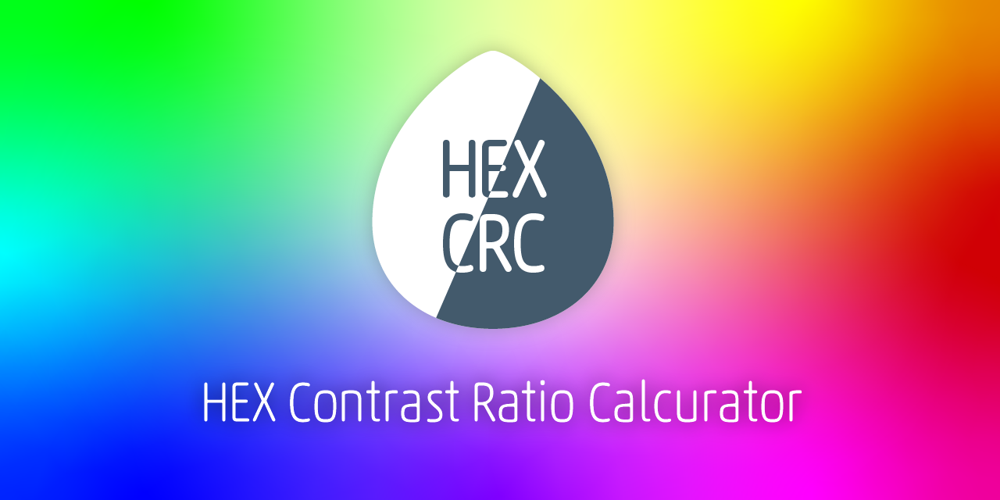

# HEX Contrast Ratio Calculator



https://hex-crc.dskd.jp

[](https://app.netlify.com/sites/hex-crc/deploys)

HEX の 2 色（前景色と背景色）のカラーセットからコントラスト比を計算し、WCAG2.0 が定める基準を達成しているかを判定します。

- HEX 以外を入力すると正しく判定できません
- 複数のカラーセットを比較できます
- テキストエリアに連想配列を入力してカラーセットに変換できます
- 逆に、調整したカラーセットを連想配列に変換できます

本検証ツールではコントラスト比が 3.0 以上 4.5 未満で「Not Bad」とし、3.0 未満は「Fail」としています。

**「Not Bad」「Fail」の区分は本検証ツールが独自に提案しているものであり、WCAG が公式に示している指標ではありません。**

また、WCAG の基準に達していないからといって見づらいとは限りませんし、達しているからといって全て見やすい訳ではありません。

コントラスト比の数字だけ見て判断せず、実際のプロダクトに当てはめて包括的な判断をするための補助ツールとしてご利用ください。

## 使い方っぽい GIF

HEX を入力するとリアルタイムにコントラスト比を算出し、AAA（7 以上）、AA（4.5 以上）、Not Bad（4.5 未満）、Fail（3 未満）を表示します。


カラーセットは「＋」ボタンで追加、「ー」ボタンで削除できます。追加時はその行の色情報を元にコピーされます。その行の前景色と背景色の両方をクリアすることもできます。


テキストエリアに連想配列を入力すると、カラーセットに反映できます。変更したカラーセットを連想配列に書き出すこともできます。


## カラーセットの連想配列について

フォーマットは下記です。テキストエリアに入力し「カラーセットに変換」ボタンを押すと反映されます。

```
[
  {
    "front":"#ff0000",
    "back":"#ffffff"
  },
  {
    "front":"#00ff00",
    "back":"#ffffff"
  }
]
```

`front` キーは前景色を示します。`back`は背景色を示します。値はいずれも HEX でなければなりません。オブジェクトの `key` と `value` はダブルクォーテーションで囲ってください。

## ライセンス

Copyright (c) oti. Under the [MIT License](LICENSE).
