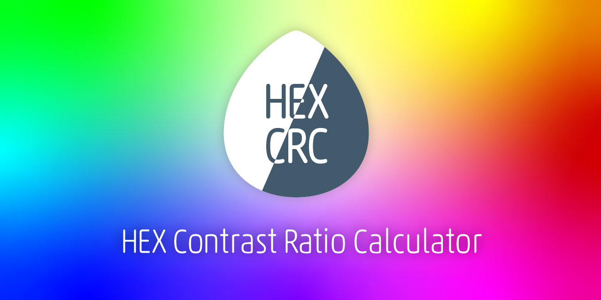

# HEX Contrast Ratio Calculator



https://hex-crc.dskd.jp

[](https://app.netlify.com/sites/hex-crc/deploys)

HEX の 2 色（前景色と背景色）のカラーセットからコントラスト比を計算し、WCAG2.1 が定める基準を達成しているかを判定します。

- HEX 以外を入力すると正しく判定できません
- 複数のカラーセットを比較できます
- テキストエリアに配列を入力してカラーセットに変換できます
- 逆に、調整したカラーセットを配列に変換できます

## 変換できる配列について

フォーマットは下記です。テキストエリアに入力し「カラーセットに変換」ボタンを押すと反映されます。

```
[
  {
    "front":"#ff0000",
    "back":"#ffffff"
  },
  {
    "front":"#00ff00",
    "back":"#ffffff"
  }
]
```

`front` キーは前景色を示します。`back`は背景色を示します。値はいずれも HEX でなければなりません。オブジェクトの `key` と `value` はダブルクォーテーションで囲ってください。

## ライセンス

Copyright (c) oti. Under the [MIT License](LICENSE).
