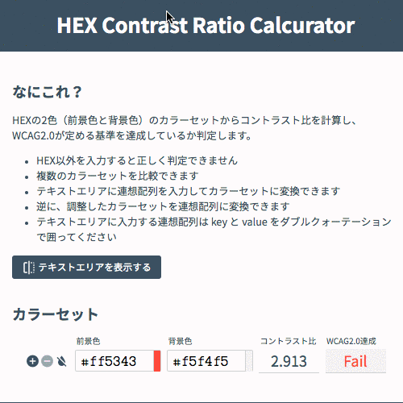
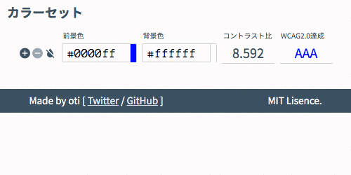
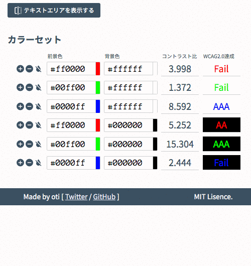

# HEX Contrast Ratio Calcurator

https://hex-crc.dskd.jp

[](https://app.netlify.com/sites/hex-crc/deploys)

HEXの2色（前景色と背景色）のカラーセットからコントラスト比を計算し、WCAG2.0が定める基準を達成しているかを判定します。

- HEX以外を入力すると正しく判定できません
- 複数のカラーセットを比較できます
- テキストエリアに連想配列を入力してカラーセットに変換できます
- 逆に、調整したカラーセットを連想配列に変換できます

## 使い方っぽいGIF

HEXを入力するとリアルタイムにコントラスト比を算出し、AAA（7以上）、AA（4.5以上）、Fail（4.5未満）を表示します。



カラーセットは「＋」ボタンで追加、「ー」ボタンで削除できます。追加時はその行の色情報を元にコピーされます。その行の前景色と背景色の両方をクリアすることもできます。



テキストエリアに連想配列を入力すると、カラーセットに反映できます。変更したカラーセットを連想配列に書き出すこともできます。



## カラーセットの連想配列について

フォーマットは下記です。テキストエリアに入力し「連想配列からセットに変換」ボタンを押すとカラーセットに反映されます。

```
[
  {
    "front":"#ff0000",
    "back":"#ffffff"
  },
  {
    "front":"#00ff00",
    "back":"#ffffff"
  }
]
```

`front` キーは前景色を示します。`back`は背景色を示します。値はいずれもHEXでなければなりません。オブジェクトの `key` と `value` はダブルクォーテーションで囲ってください。

## ライセンス

MIT Lisence.